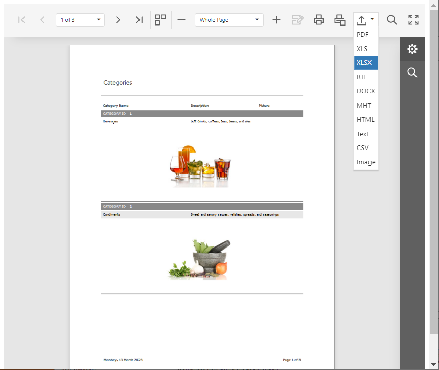
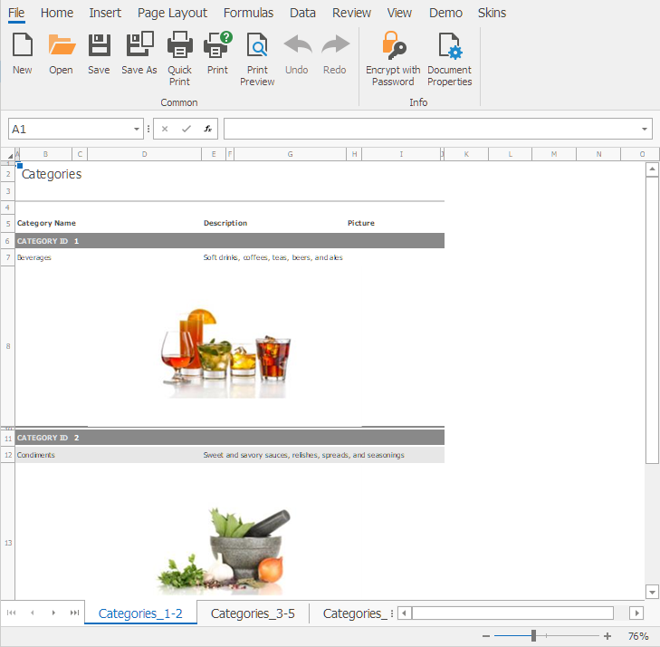

# Web Reporting - How to Manage Events of a Cached Document and Pass Custom Data to the Exported Document

This example creates and registers a descendant of our [WebDocumentViewerOperationLogger](https://docs.devexpress.com/XtraReports/DevExpress.XtraReports.Web.WebDocumentViewer.WebDocumentViewerOperationLogger) class to attach the [XlSheetCreated](https://docs.devexpress.com/CoreLibraries/DevExpress.XtraPrinting.PrintingSystemBase.XlSheetCreated) event handler to the document.

This example also illustrates the technique used to restore event handlers after a document is serialized in the cache and all event handlers are detached.

Run the application and select **Export to XLSX**:

The product category is used to rename worksheets in the exported XLSX file. The category is displayed in the report on the page from which the worksheet originated.

## Files to Look At

* [CustomWebDocumentViewerOperationLogger.cs](CustomCachedDocumentSourceSerialization/Services/CustomWebDocumentViewerOperationLogger.cs)

## Documentation

* [Web Document Viewer Cache Management](https://docs.devexpress.com/XtraReports/404234/web-reporting/general-information-on-web-reporting/document-viewer-caching)